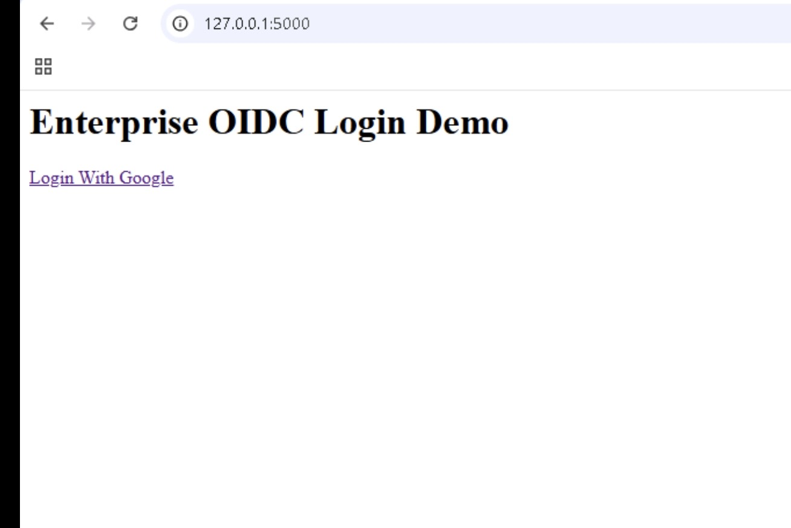
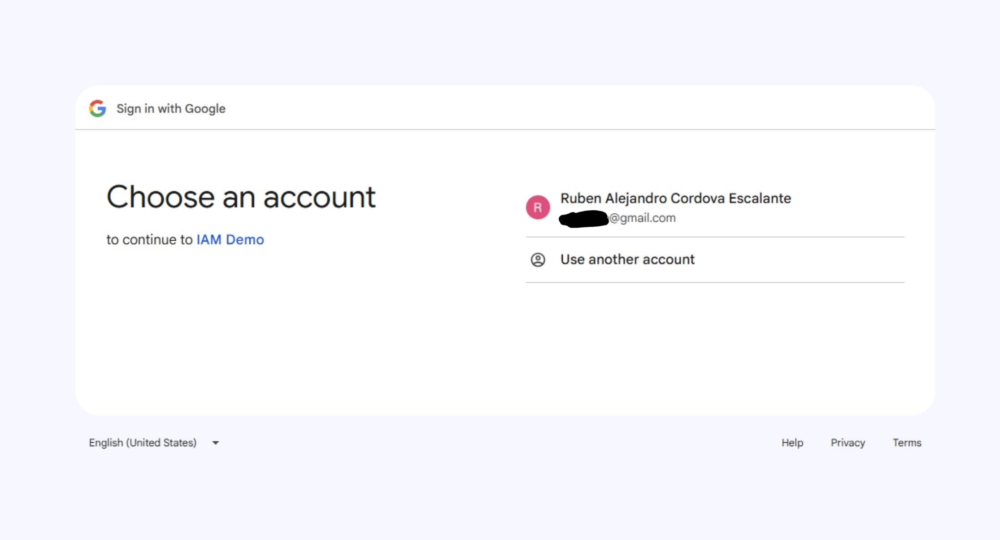
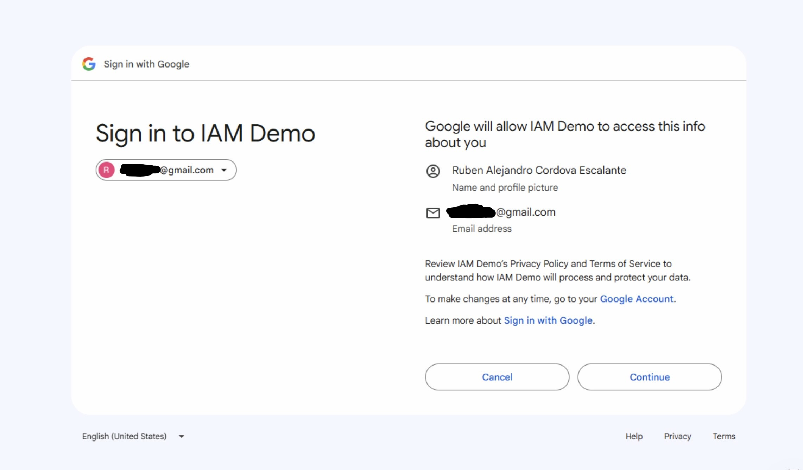
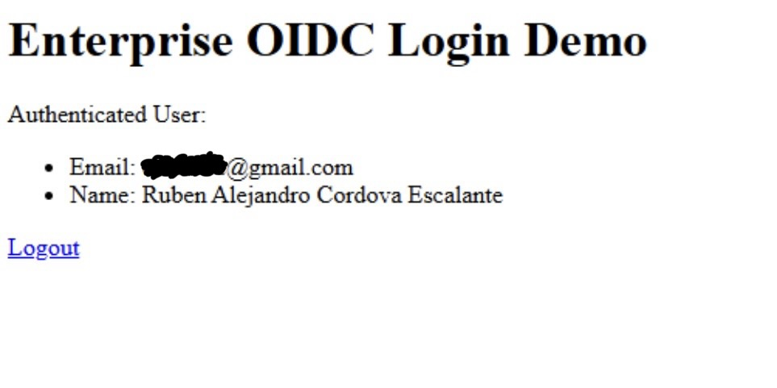

# Enterprise OIDC Login Demo

This project demonstrates a modern OpenID Connect (OIDC) authentication flow using Python Flask and Google Identity Provider.

The purpose of this project is to simulate how enterprise SaaS platforms authenticate users using centralized identity providers instead of storing passwords locally.

## Features

- OpenID Connect authentication
- OAuth2 authorization flow
- Session management
- Enterprise-style login architecture
- Secure identity delegation
- Centralized authentication concepts

## Technologies

- Python
- Flask
- Authlib
- OAuth2
- OpenID Connect (OIDC)

## Real World Relevance

Modern organizations use OIDC extensively for:
- Enterprise Single Sign-On (SSO)
- Workforce identity management
- Cloud application authentication
- Zero Trust architectures

Examples:
- Google Login
- Microsoft Entra ID
- Okta Workforce Identity

## Setup

Create a `.env` file with your environment variables:

```env
GOOGLE_CLIENT_ID=your_client_id
GOOGLE_CLIENT_SECRET=your_client_secret
FLASK_SECRET_KEY=your_secret_key
```

Install dependencies:

```bash
pip install -r requirements.txt
```

Run:

```bash
python app.py
```

## Security Concepts Demonstrated

- Identity Federation
- Token-Based Authentication
- Least Credential Exposure
- Centralized Authentication
- Secure Session Management

## OIDC Login Demo Screenshots

### 1. Login Page



### 2. Google Login



### 3. Successful Login



### 4. Success



## Educational Purpose

This project was built to demonstrate enterprise IAM authentication workflows commonly used in cybersecurity and cloud infrastructure environments.
