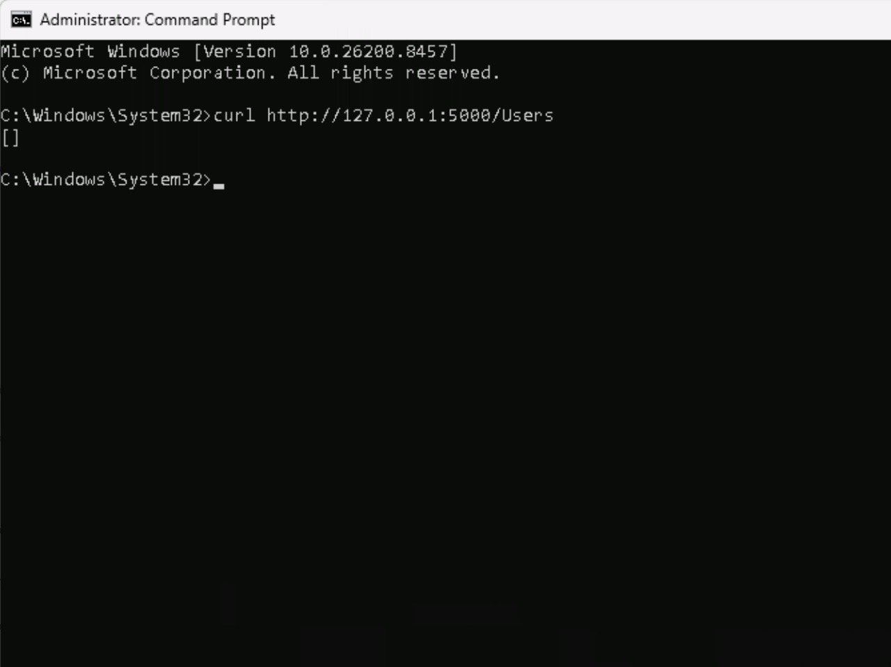
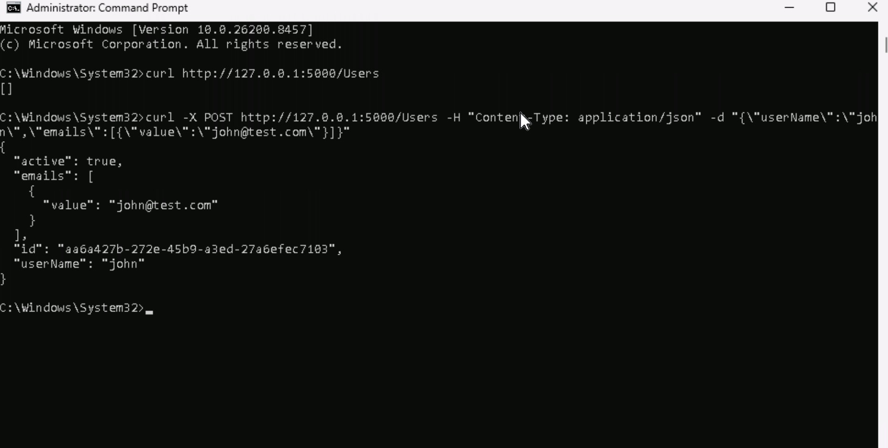
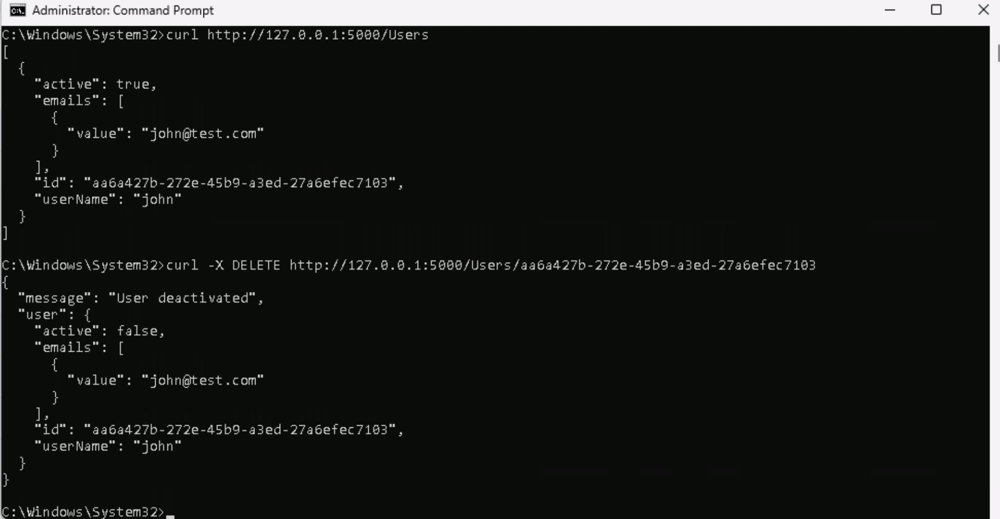
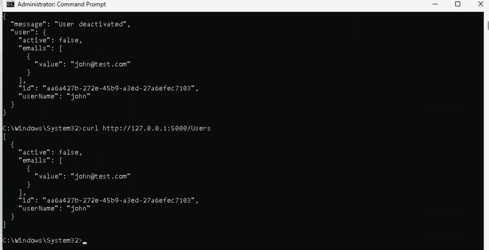

# SCIM Provisioning Platform

This project demonstrates a simplified SCIM (System for Cross-domain Identity Management) provisioning API using Python Flask.

The platform simulates how enterprise identity systems automatically create, manage, and deactivate user accounts across organizational infrastructure.

## Features

- User provisioning
- User lifecycle management
- Account deactivation
- REST API architecture
- Identity synchronization concepts

## Technologies

- Python
- Flask
- REST APIs
- SCIM Concepts

## Enterprise Use Cases

Organizations use SCIM to automate:
- Employee onboarding
- Account creation
- Role synchronization
- User deactivation
- Identity lifecycle management

Examples:
- Okta
- Microsoft Entra ID
- Google Workspace
- Workday integrations

## Example Request

```json
POST /Users
{
 "userName": "john",
 "emails": [
   {
     "value": "john@company.com"
   }
 ]
}
```

## Run

```bash
pip install -r requirements.txt

python app.py
```

After run app.py you can:

## 1. Check Users (GET)

```bash
curl -X POST http://127.0.0.1:5000/Users
```



In the example first run is empty, no users.

## 2. Create User (POST)

```bash
curl -X POST http://127.0.0.1:5000/Users -H "Content-Type: application/json" -d "{\"userName\":\"john\",\"emails\":[{\"value\":\"john@test.com\"}]}"
```



User is added to the system with `active: true`.

To verify it was added:

```bash
curl -X POST http://127.0.0.1:5000/Users
```


## 3. Deactivate User (DELETE)

```bash
curl -X DELETE http://127.0.0.1:5000/Users/PASTE_ID_HERE
```



In the test is False it was successfully deactivated:



## Security Concepts Demonstrated

- Identity Lifecycle Management
- Automated Provisioning
- Centralized Identity Governance
- Enterprise Access Management
- User Deactivation Controls

## Educational Purpose

This project demonstrates core IAM provisioning concepts commonly found in enterprise security infrastructure.
