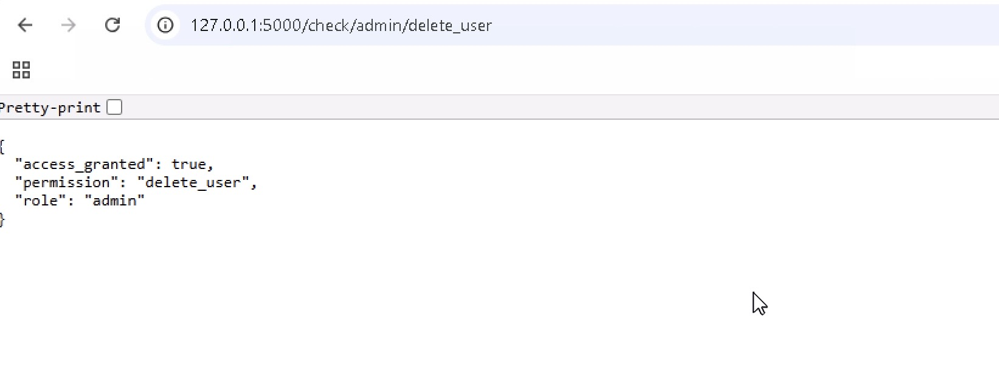
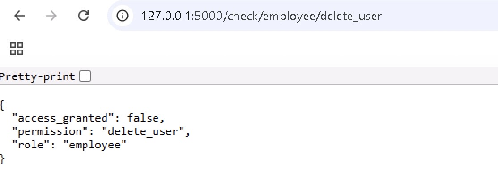
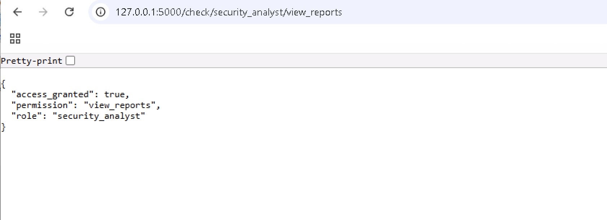

# RBAC Enterprise Access Control

This project demonstrates a Role-Based Access Control (RBAC) authorization system using Python Flask.

The platform simulates enterprise authorization workflows used to enforce least-privilege access policies across internal systems.

## Features

- Role-based permissions
- Access validation
- Authorization decision engine
- Least-privilege concepts
- Enterprise security policy simulation

## Technologies

- Python
- Flask
- REST APIs

## Roles Included

- Admin
- Employee
- Security Analyst

## Example Request

```bash
/check/admin/manage_servers

/check/employee/delete_user
```

## Security Concepts Demonstrated

- Least Privilege
- Fine-Grained Authorization
- Separation of Duties
- Enterprise Authorization Models
- Access Governance

## Enterprise Relevance

RBAC is heavily used in:
- Cloud Infrastructure
- Internal Corporate Systems
- SOC Platforms
- DevOps Environments
- Identity Access Management Systems

## Run

```bash
pip install -r requirements.txt

python app.py
```

## RBAC Access Control Demo

### Admin Access



### Employee Access Denied



### Security Analyst Access



## Educational Purpose

This project demonstrates foundational authorization concepts used in enterprise cybersecurity and identity governance environments.
